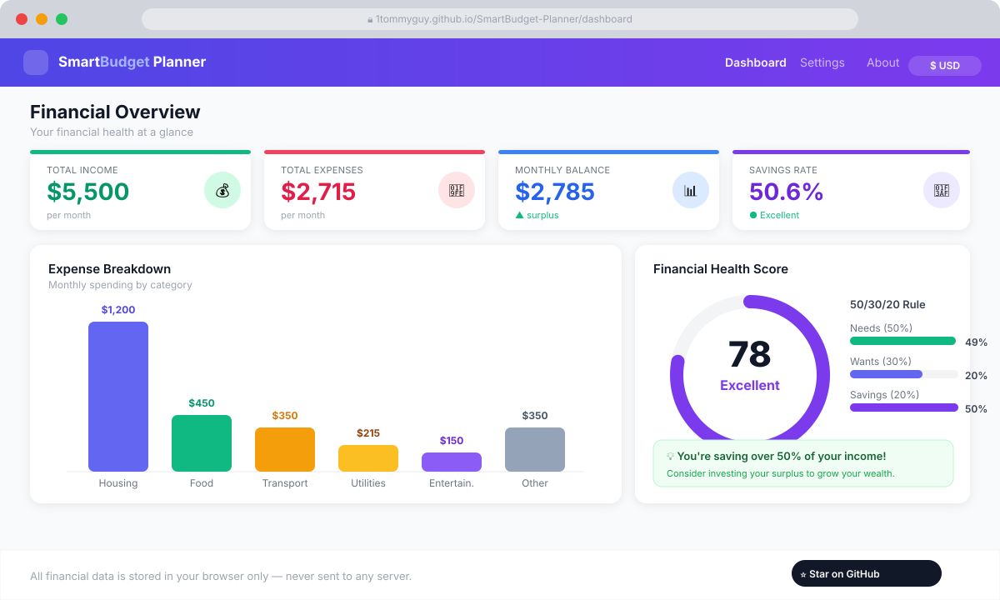
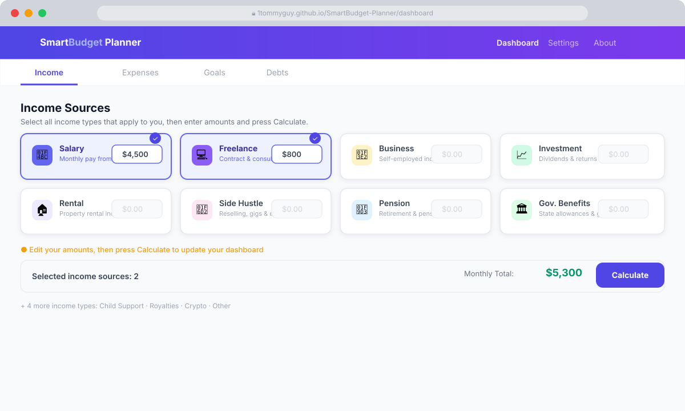
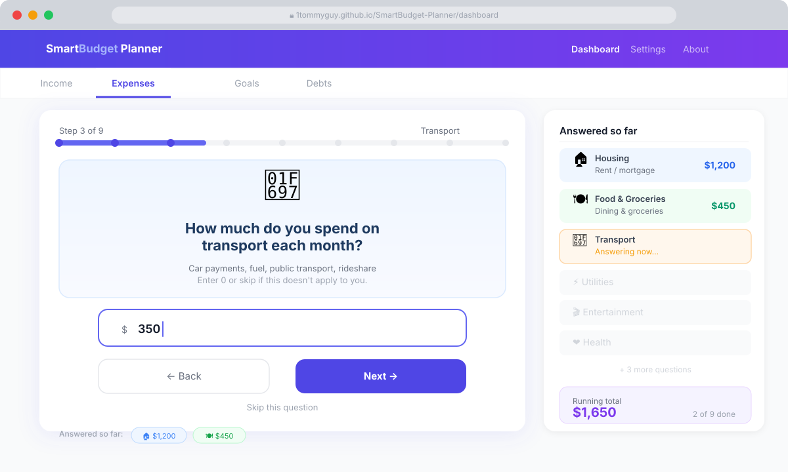

<div align="center">

# SmartBudget Planner

**Free, privacy-first personal finance — no account, no servers, no tracking.**

[](https://1tommyguy.github.io/SmartBudget-Planner/)
[](https://github.com/1tommyguy/SmartBudget-Planner/stargazers)
[](LICENSE)

### [→ Try it live now](https://1tommyguy.github.io/SmartBudget-Planner/)

</div>

---

## Screenshots

### Dashboard — financial overview at a glance


### Income — pick your income types, enter amounts, press Calculate


### Expenses — step-by-step Q&A wizard, one question at a time


---

## What is it?

SmartBudget Planner helps you understand where your money goes, set savings goals, and pay off debt — all inside your browser. Nothing is ever sent to a server.

- Choose your **currency** (USD, NGN, GBP, EUR, and 6 more)
- Pick your **income types** from 12 options — salary, freelance, rental, side hustle, etc.
- Answer a **guided Q&A** to log monthly expenses in 9 categories
- Instantly see your **financial health score**, budget breakdown, and personalised tips

## Features

| Feature | Description |
|---|---|
| 📊 Smart Dashboard | Real-time income, expenses, balance, and savings rate cards |
| 💰 Income Picker | Choose from 12 income types; enter amounts and press Calculate |
| 🧾 Expense Wizard | Step-by-step Q&A for 9 expense categories with smooth animations |
| 🎯 Savings Goals | Set targets with deadlines — auto-calculates monthly amount needed |
| 📈 Financial Health Score | 0–100 score based on savings rate, spending ratio, emergency fund |
| 🚨 Emergency Fund Calculator | See how long to reach 3, 6, and 12-month fund targets |
| 💳 Debt Payoff Estimator | Slider shows how extra payments cut interest and time |
| ⚖️ 50/30/20 Rule | Live comparison of your spending vs the proven framework |
| 🌍 Multi-currency | USD, EUR, GBP, NGN, CAD, AUD, JPY, INR, BRL, MXN |
| 🌙 Dark Mode | Light / Dark / System theme toggle |
| 📄 Export | Download a PDF report or CSV spreadsheet in one click |
| 🔒 100% Private | All data lives in browser localStorage — zero server contact |

## Getting started (users)

Open the app: **[https://1tommyguy.github.io/SmartBudget-Planner/](https://1tommyguy.github.io/SmartBudget-Planner/)**

1. **Settings** → pick your **currency** ← *do this first!*
2. **Dashboard → Income** → select your income types → enter amounts → **Calculate**
3. **Dashboard → Expenses** → answer the step-by-step questions → **Calculate**
4. (Optional) Add **Savings Goals** and **Debts**
5. Read your **financial health score** and tips on the Overview

## Running locally (developers)

```bash
git clone https://github.com/1tommyguy/SmartBudget-Planner.git
cd SmartBudget-Planner
npm install
npm run dev
```

Open [http://localhost:3000](http://localhost:3000).

## Tech stack

Next.js · TypeScript · Tailwind CSS · Recharts · jsPDF · next-themes

## Contributing

Pull requests are welcome. Open an issue first to discuss major changes.

## License

MIT — free to use, fork, and distribute.

---

<div align="center">

If this project helps you, please consider giving it a ⭐ — it helps others find it!

**[⭐ Star this repo](https://github.com/1tommyguy/SmartBudget-Planner/stargazers)**

</div>
